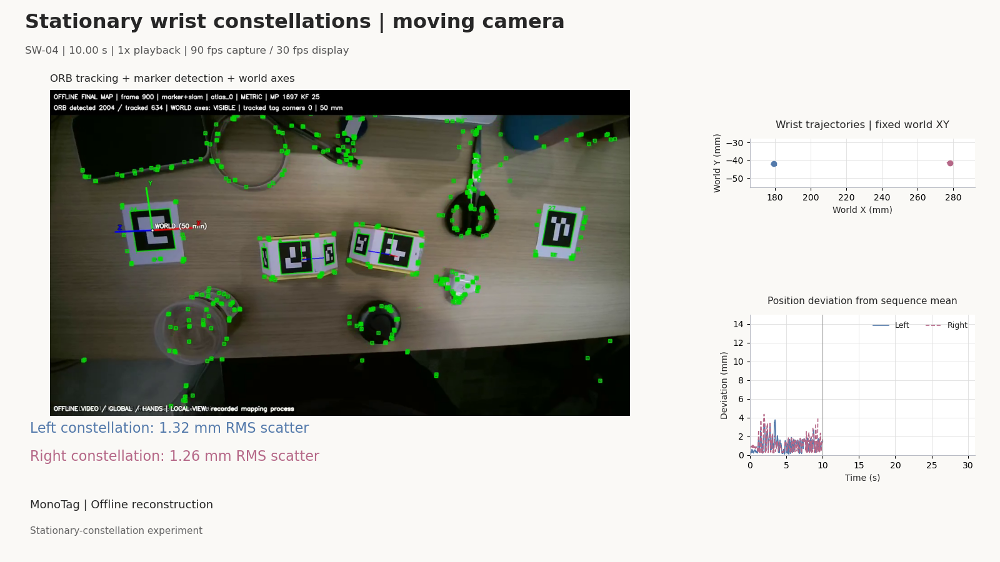

# MonoEgo

Anonymous review materials for **Monocular Metric Egocentric Demonstration Capture with Passive Wrist Constellations and Sparse Workstation Anchors**.

MonoEgo moves sensing complexity from active wrist electronics to offline geometry. One head-mounted RGB camera observes passive printable wrist constellations, natural scene features, and sparse known-size workstation markers on a shared image clock. MonoTag SLAM provides the metric camera trajectory and Atlas; the calibrated wrist constellations provide metric wrist-fixture trajectories when visible. Unsupported intervals remain invalid rather than being filled as measurements.

## Why a single image clock?

The camera, wrist markers, workstation markers, hands, and scene appearance are observed in the same frames. The capture setup therefore avoids temporal synchronization between video and separate wrist IMUs or wireless trackers, as well as their cross-device extrinsic calibration. Camera and fixture calibration are still required.

## Review material

- [`videos/`](videos/) contains two representative English stationary-constellation demonstrations with ORB features, accepted markers, camera/world status, and trajectories.
- [`figures/`](figures/) contains the system overview, camera-reference trajectory plot, and stationary-constellation precision plot used for review.
- [`hardware/`](hardware/) contains the printable wrist-fixture release, marker layouts, and ChArUco calibration board.
- [`results/`](results/) contains compact source tables for the camera-reference and stationary-constellation experiments.

The companion MonoTag source repository is provided through the separate anonymous code link in the paper.

## Capture hardware

The tested capture system uses a WN-L2406K397L global-shutter camera module with a 2.3 mm, f/1.8, M12 lens (nominal 130° diagonal, 117° horizontal, and 78° vertical field of view). Reconstruction always uses calibrated intrinsics. The measured capture-side bill of materials was below US$100; the recorder, offline compute host, labour, shipping, fasteners, and consumables were excluded.

The wrist fixtures are passive: no wrist battery, IMU, radio, or independent clock is used. The supplied layout files describe the marker geometry used by the software; printed marker size and physical assembly must be verified before capture.

## Evidence boundaries

- The camera experiment compares against odometry from a lidar--visual system. It is a reference trajectory, not an input to MonoTag and not independently certified absolute ground truth.
- SE(3) and Sim(3) alignment answer different questions and are reported separately.
- Stationary-constellation recordings measure precision under a known stationary condition; they do not establish dynamic or anatomical wrist accuracy.
- Optional hand estimates, marker masks, and appearance-edited RGB are derived outputs. Edited imagery never feeds localization or label generation.
- Raw indoor RGB is not published in this anonymous review repository because it may contain identifiable imagery.

## Representative videos

### SW-02

[Download MP4](videos/SW-02_english_orb_trajectories.mp4)

### SW-04

[Download MP4](videos/SW-04_english_orb_trajectories.mp4)

