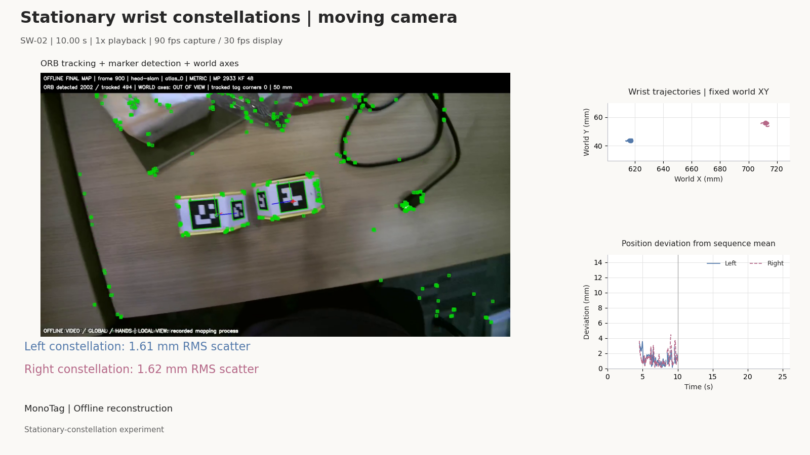

# MonoEgo
**Monocular Metric Egocentric Demonstration Capture with Passive Wrist Constellations and Sparse Workstation Anchors**

[Project homepage](https://jiejie567.github.io/MonoEgo/) · [MonoTag SLAM code](https://github.com/jiejie567/MonoTag-SLAM) · [Hardware](hardware/README.md) · [Results](results/README.md)

English | [中文](README_CN.md)

MonoEgo records human operations with a head-mounted RGB camera, two passive wrist fixtures and known-size workstation markers. Offline reconstruction produces metric camera and wrist-fixture trajectories from the same image stream.

The fixtures need no battery, IMU or radio. Video and geometric observations share one image clock, avoiding separate tracker-to-video synchronization. Camera and wrist-constellation calibration are still required.

This public repository contains hardware, compact experimental results and representative demonstrations. Public processing code is maintained separately in [MonoTag SLAM](https://github.com/jiejie567/MonoTag-SLAM).

## From recording to trajectories

1. Print and assemble the fixtures and markers; verify physical dimensions.
2. Calibrate camera intrinsics and rigid wrist-marker geometry.
3. Record unchanged RGB video.
4. Run marker-constrained MonoTag reconstruction and optional hand estimation.
5. Inspect validity, trajectories and map events before exporting data.

Known marker dimensions provide metric information. Repeated views constrain scale and map consistency. Offline matching can recover earlier or short-gap poses when sufficient evidence exists. Appearance-edited RGB remains a separate derived product and never feeds back into localization.

## What's included

- [Printable hardware](hardware/README.md): magnetic wrist fixtures, marker sheets and ChArUco target.
- [Example calibrated layouts](hardware/marker_layouts/calibrated_release/): geometry of the specific tested fixtures, not a substitute for calibrating a new assembly.
- [Result sources](results/README.md): camera-reference and stationary-wrist summaries.
- [Representative videos](videos/): stationary-fixture demonstrations with ORB features and trajectories.
- [Processing code](https://github.com/jiejie567/MonoTag-SLAM): calibration, capture, reconstruction, replay and optional export.

## Hardware

The default design is **REV5: two halves, two rubber-band grooves, no magnet holes**. Download the [STLs and matching marker sheets](hardware/wrist_constellation_REV5/). Add foam padding inside to fit different wrist sizes, and secure the seated halves with one rubber band in each groove. See the [assembly guide](hardware/README.md).

### Camera selection

No particular camera brand or model is required. Prioritize **high frame rate, manual exposure control, and a wide field of view** that covers both hands and enough surrounding scene. High FPS alone does not guarantee sharp frames: set a sufficiently short exposure for the motion and provide adequate light. Keep enough image detail for the wrist markers; a wider view is not automatically better if the markers become too small.

The tested setup uses a WN-L2406K397L global-shutter module, a 2.3 mm f/1.8 M12 lens and 1920 × 1080 recording at 90 FPS. This is a reference configuration, not a required purchase. Global shutter is preferable for rapid camera motion; alternative cameras are not guaranteed to match the reported results. Calibrate the chosen lens and recording mode, and keep focus, crop and stabilization settings unchanged during capture. Reconstruction uses measured intrinsics, not nominal field of view.

Reported capture-side cost was below US$100, excluding the recorder, replacement lens, offline compute, small fasteners and consumables, labour and shipping. This is not the cost of a complete recording and processing system.

Print at actual size, disable fit-to-page, and measure the black square rather than the white paper. Adjust foam thickness for a stable, comfortable fit without excessive pressure. Calibrate each newly assembled constellation.

## Representative videos

### Moving camera, stationary wrist fixtures

[SW-02 video](videos/SW-02_english_orb_trajectories.mp4)

[SW-04 video](videos/SW-04_english_orb_trajectories.mp4)

These examples test whether camera motion appears as motion of a stationary fixture. They measure positional precision, not full dynamic hand-motion accuracy.

## Experimental scope

Camera motion is compared against Odin multisensor odometry as a reference. Metric error uses SE(3) alignment; Sim(3) results are separate because that alignment removes global scale error. Read error together with tracking coverage.

Across four stationary-wrist recordings, per-side RMS scatter was approximately 1.26–2.69 mm. This does not establish equivalent anatomical or dynamic accuracy. See [result sources](results/README.md) for the protocol and tables.

Raw indoor recordings, private screen content, machine-local paths and learned weights are excluded. The unblurred company-video review is not uploaded here.

## Getting started

Follow the [Ubuntu installation guide](https://github.com/jiejie567/MonoTag-SLAM/blob/main/docs/INSTALL.md). Start with SLAM and geometric wrist observations; learned hand inference and training-format export are optional.

## License

Original hardware, layouts, figures, result tables and documentation use [CC BY 4.0](LICENSE.md). Attribute **MonoEgo — Anyverse Dynamics** and indicate changes. Third-party material retains its original license. The company logo is excluded; no trademark or endorsement rights are granted.

Companion code uses GPL-3.0 because it includes modified ORB-SLAM3. Model and dataset terms still apply separately.
