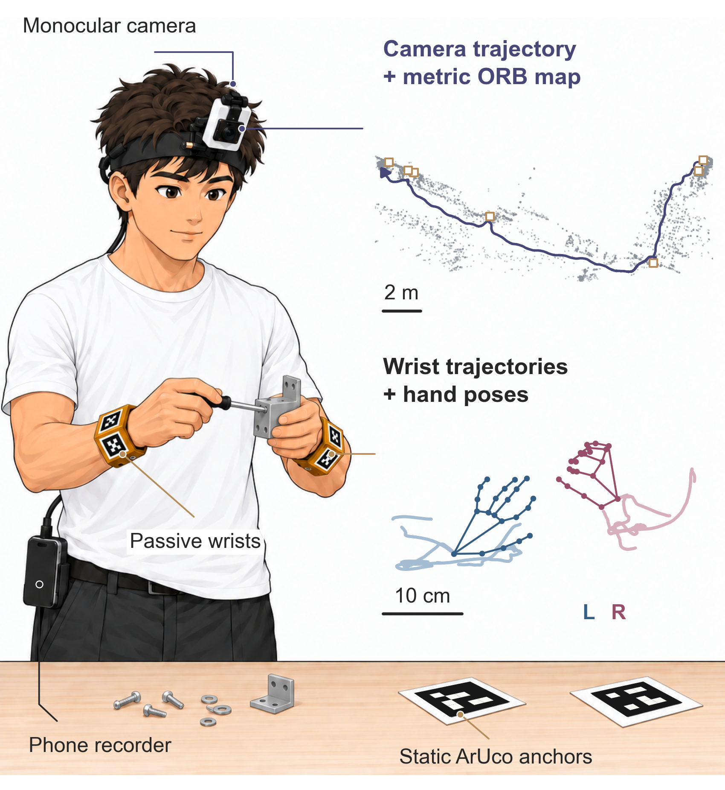
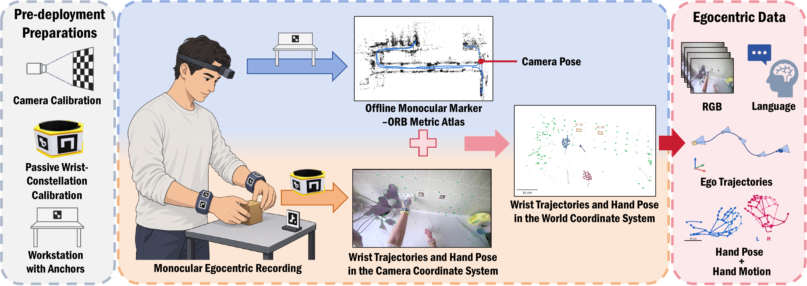
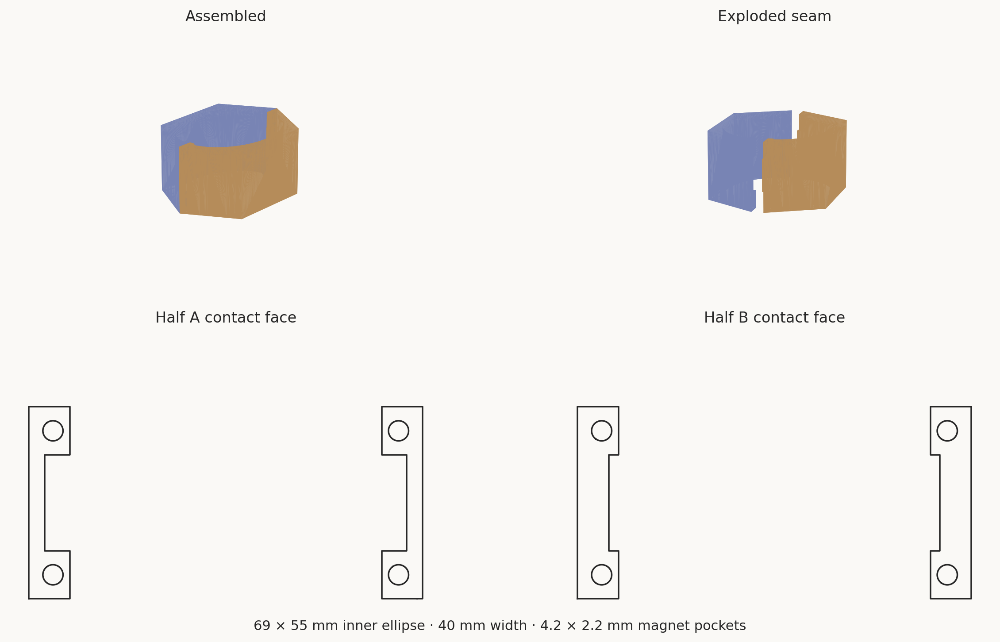

# MonoEgo

**单目第一人称操作数据采集**

[MonoTag SLAM 源码](https://github.com/jiejie567/EgoMono) · [硬件](hardware/README.md) · [实验结果](results/README.md)

[English](README.md) | 中文

MonoEgo 使用一台头戴 RGB 相机、两只无源腕带和工位上的已知尺寸 marker，录制操作视频，再离线重建米制相机与腕带轨迹。

腕带不需要电池、IMU 或无线模块。场景、手和 marker 都来自同一图像时钟，无需额外对齐独立手部追踪设备与视频。相机内参和腕带星座几何仍需要标定。

本仓库保存硬件、示例视频与紧凑实验结果；处理代码在 [EgoMono / MonoTag SLAM](https://github.com/jiejie567/EgoMono)。目前两个仓库均保持 private，尚未公开发布。

## 使用流程

打印和装配 → 核实 marker 尺寸 → 标定相机与腕带 → 录制原始视频 → 离线重建 → 检查有效性和轨迹 → 按需导出。

已知 marker 尺寸提供尺度，多帧几何共同约束地图。离线回溯只恢复证据充分的帧，不承诺所有视频都能从第一帧定位。可选的 marker 外观覆盖不会反馈到定位与标签生成。

## 硬件与文件

无魔术贴的双半磁吸腕带。分别下载 [A 半 STL](hardware/wrist_constellation_v4/strap_half_A_magnetic_no_velcro.stl) 和 [B 半 STL](hardware/wrist_constellation_v4/strap_half_B_magnetic_no_velcro.stl) 用于打印；[组合 STL](hardware/wrist_constellation_v4/strap_band_magnetic_no_velcro_print.stl) 用于查看整体结构。

- [双半磁吸腕带 STL、贴纸和标定板](hardware/README.md)。
- [已标定腕带布局示例](hardware/marker_layouts/calibrated_release/)仅对应实验中的实物；新装配应重新标定。
- [SW-02 示例](videos/SW-02_english_orb_trajectories.mp4)和 [SW-04 示例](videos/SW-04_english_orb_trajectories.mp4)展示相机移动、腕带静止时的轨迹。
- [相机参考与静止腕带结果](results/README.md)。

验证配置采用 WN-L2406K397L 全局快门模组、2.3 mm f/1.8 M12 镜头，录制 1080p / 90 FPS。算法使用标定内参。所统计的采集侧 BOM 不到 100 美元，不含录制设备、替换镜头、计算机、小五金与耗材、人工和运费。

打印时关闭“适应页面”，实测黑色方形外边长。佩戴前检查磁铁固定、极性与皮肤间隙。

## 实验解释

Odin 多传感器里程计用于相机参考，不是算法输入或独立认证的绝对真值。SE(3) 与消除全局尺度的 Sim(3) 指标分开报告，误差需结合覆盖率阅读。

四段静止腕带实验的单侧 RMS 散布约为 1.26–2.69 mm。这是静止条件下的精密度，不代表动态动作或解剖学手腕精度。

仓库不包含原始室内视频、私人屏幕内容、模型权重或机器私有配置。此次无模糊宣发审阅视频不上传仓库。

## 许可

原创硬件、布局、图稿、结果表和文档使用 [CC BY 4.0](LICENSE.md)，署名 MonoEgo — Anyverse Dynamics，并注明修改。公司 Logo 不包含在此许可中，第三方材料保留原许可。配套 SLAM 代码使用 GPL-3.0。
