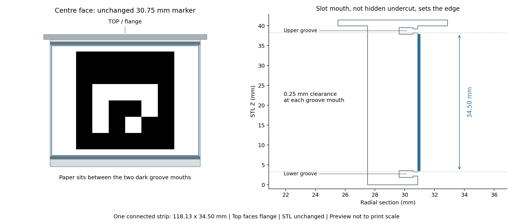

# Hardware release

## Current design: REV5

Use [REV5 STLs and matching marker files](wrist_constellation_REV5/): two halves with two circumferential rubber-band grooves and **no magnet holes**. The older `wrist_constellation_v4/` magnetic design is retained only for historical reference, not as the default print.

- [Half A STL](wrist_constellation_REV5/REV5_strap_half_A_no_magnet_holes_full_loop_snap_in_rubber_grooves.stl)
- [Half B STL](wrist_constellation_REV5/REV5_strap_half_B_no_magnet_holes_full_loop_snap_in_rubber_grooves_xy_tight.stl)
- [Matching left/right marker strips — A4 PDF](wrist_constellation_REV5/REV5_groove_fit_connected_strips_A4.pdf)
- [Print preview](wrist_constellation_REV5/REV5_print_preview.png): preview only, print the PDF.
- Nominal CAD layouts: [left](wrist_constellation_REV5/strap_REV5_L_nominal.json), [right](wrist_constellation_REV5/strap_REV5_R_nominal.json). These are calibration starting points, not measured layouts.

## Assembly and fit

1. Print both halves at original scale. Remove sharp edges and check that the mating faces seat properly.
2. Attach soft foam padding inside. Adjust its thickness to fit the wearer's wrist without altering rigid shell geometry. Do not place foam between mating faces or force the shell open to fit a larger wrist.
3. Join the halves and put one rubber band in each circumferential groove. Check band retention and keep marker faces unobstructed. No magnets are required.
4. Fit should be stable and comfortable, without excessive pressure, pain or numbness. Stop wearing it if uncomfortable; a fixed shell cannot accommodate every wrist size.
5. Apply the matching strips between the grooves, following the printed top/flange and left/right labels. Avoid wrinkles or lifted corners. Calibrate each newly assembled constellation and recheck after changing stickers or assembly.

### 中文说明

护腕内部贴柔软海绵，通过厚度适配不同腕围。两瓣正确扣合后，上下两圈凹槽内各套一根橡皮筋固定，不需要磁铁。海绵不要夹进接缝，也不要为了容纳粗手腕而撑开外壳。佩戴应稳定、舒适、不勒手，疼痛或麻木时停止使用。贴纸位于两圈槽之间，橡皮筋不能遮挡码；重新装配或更换贴纸后进行腕带星座标定。

## Camera selection

The camera is not model-specific. Choose high-frame-rate recording, manual exposure control and a wide field of view covering both hands and background. Balance field of view with sufficient marker pixels, and use short exposure with adequate lighting. The tested 1080p/90-FPS global-shutter configuration is documented in the [main README](../README.md#camera-selection); it is not a mandatory model. Calibrate the actual lens and recording mode and keep image geometry stable during capture.

## Marker printing and calibration

Use the REV5 PDF at **100% / actual size**. Dictionary: `DICT_4X4_50`; small/large black squares: 21.5/30.75 mm. Verify black-square outer edges with a ruler. The connected strip is approximately 118.13 × 34.50 mm. The nominal JSON files retain their calibration warning; foam padding does not establish an anatomical wrist frame.

The older sheets in the root of `marker_layouts/` are legacy files. Prefer the matching REV5 PDF above; do not substitute older sheets without checking fit. The physical assembled constellation must be calibrated before quantitative capture; nominal JSON is not a substitute.

`marker_layouts/calibrated_release/` contains the measured rigid constellation geometry used for the reported final wrist experiments. These files reproduce that particular assembled pair of fixtures; they are not universal replacements for calibrating a newly printed and assembled fixture. Marker IDs and corner coordinates are unchanged from the experiment configuration, while local absolute source paths have been removed for anonymous release.

`marker_layouts/charuco_A4.pdf` is the camera-calibration target. Intrinsics are valid only for the same lens, focus, resolution, crop, stabilization, and camera mode used during calibration.

Original designs and layouts use [CC BY 4.0](../LICENSE.md). The accompanying
geometry describes marker fixtures, not anatomical hand calibration.
